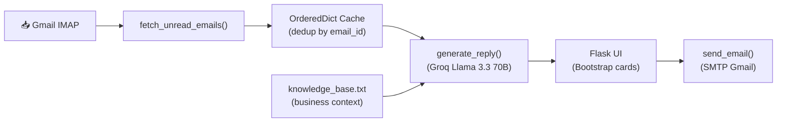

<p align="center">
  
</p>

<p align="center">
  <a href="https://email-agent-wstm.onrender.com/" target="_blank">
    
  </a>
</p>

<p align="center">
  <a href="#features">Features</a> ·
  <a href="#architecture">Architecture</a> ·
  <a href="#quick-start">Quick Start</a> ·
  <a href="#project-structure">Structure</a> ·
  <a href="#comparison">Comparison</a>
</p>

<p align="center">
  
  
  
  
  
  
</p>

---

Fetches unread Gmail emails and generates AI-powered replies using Groq LLM. Built with Flask.

## Features

- **Gmail IMAP Integration** — Fetches only unread emails, deduplicates with session cache
- **AI Reply Generation** — Groq Llama 3.3 70B generates context-aware customer support replies
- **Knowledge Base** — Business info, services, pricing loaded from `knowledge_base.txt`
- **Editable Drafts** — Review and edit AI drafts before sending
- **SMTP Sending** — Send replies directly from the web UI
- **Bootstrap UI** — Clean email dashboard with cards per message

## Architecture



| Component | Stack |
|---|---|
| **Framework** | Flask (Python) |
| **Email Fetch** | IMAP4_SSL (Gmail) |
| **LLM** | Groq `llama-3.3-70b-versatile` (temperature 0.2) |
| **Context** | `knowledge_base.txt` loaded at startup |
| **UI** | Bootstrap 5 (editable drafts per email) |
| **Sending** | SMTP with STARTTLS |
| **Deployment** | Render (gunicorn) |

## Quick Start

```bash
git clone https://github.com/kairav7220/email-agent.git
cd email-agent
pip install -r requirements.txt
```

Set your credentials in `.env`:

```env
EMAIL_ADDRESS="your@gmail.com"
EMAIL_PASSWORD="gmail-app-password"
GROQ_API_KEY="gsk_..."
```

```bash
python app.py
```

Visit `http://localhost:5000` — unread emails appear with AI-generated drafts.

## Comparison

| Feature | Email Agent | Gmail Canned Responses | Manual Reply |
|---|---|---|---|
| Auto-generate replies | ✅ Groq LLM | ❌ | ❌ |
| Business knowledge base | ✅ Loaded from file | ❌ | — |
| Review before sending | ✅ Editable drafts | ✅ | — |
| Fetch unread automatically | ✅ IMAP | ❌ | — |
| Multi-LLM support | ✅ Groq (+ Mistral/Gemini commented) | ❌ | — |

## Project Structure

```
email-agent/
├── app.py                    # Flask app (IMAP → AI → SMTP)
├── knowledge_base.txt        # Business context for AI replies
├── requirements.txt          # Python dependencies
├── templates/
│   └── index.html            # Bootstrap email dashboard
├── CONTRIBUTING.md           # Contribution guide
├── llms.txt                  # AI assistant context
├── .gitignore
└── LICENSE                   # MIT
```

## License

MIT © [kairav7220](https://github.com/kairav7220)

---

<p align="center">
  Built with <a href="https://flask.palletsprojects.com">Flask</a> ·
  <a href="https://groq.com">Groq</a> ·
  <a href="https://mail.google.com">Gmail API</a>
</p>
